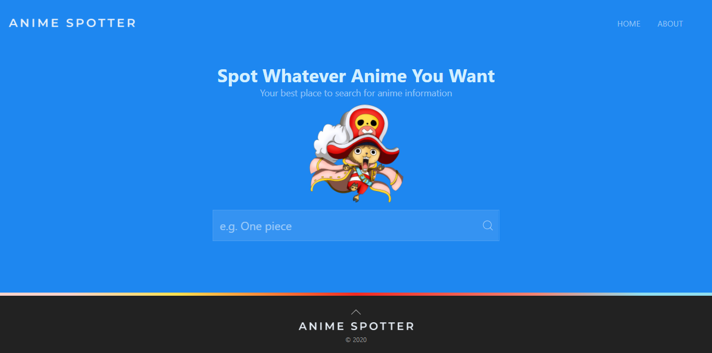
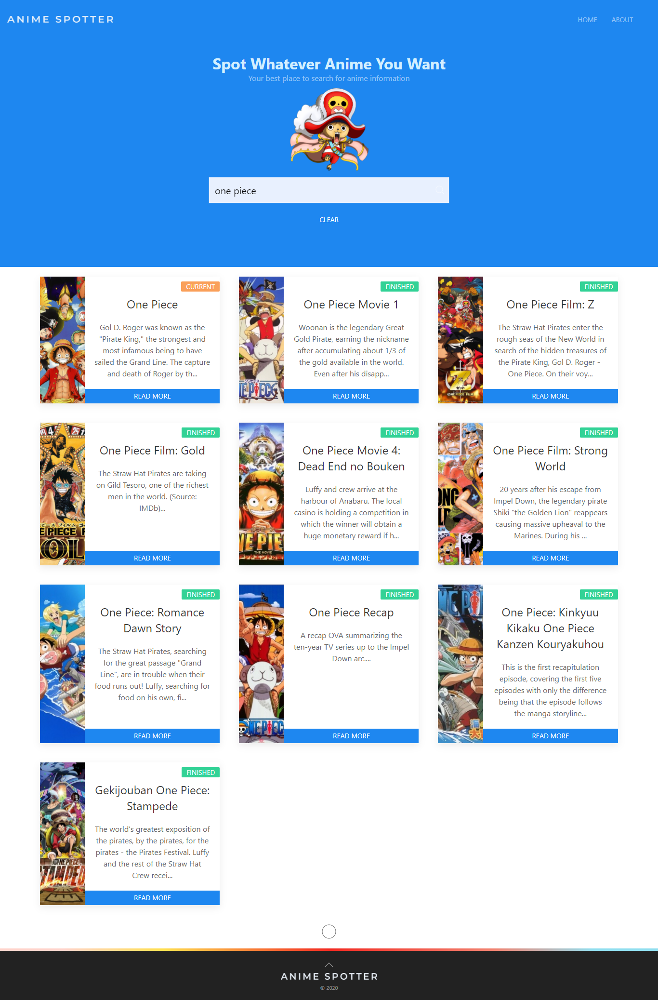
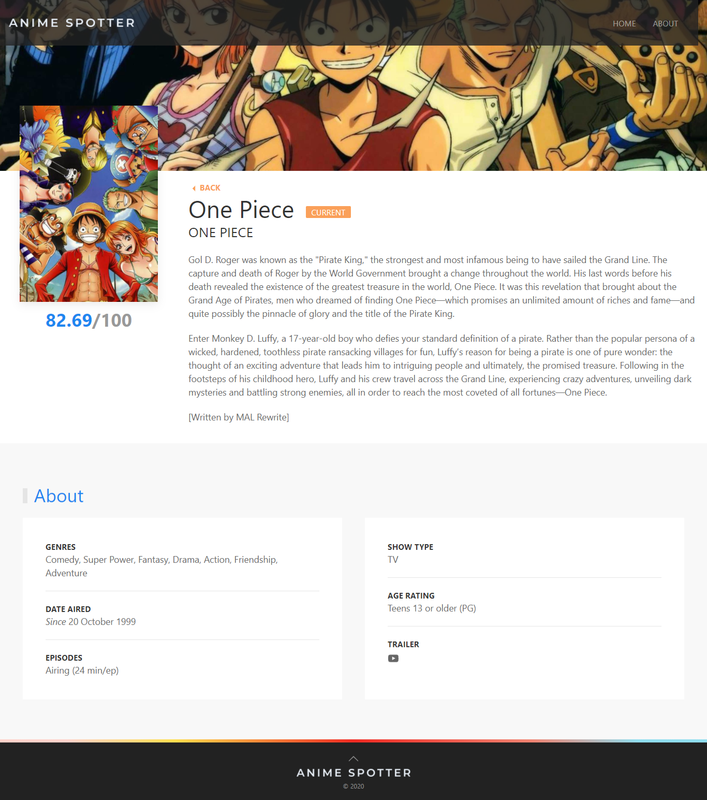
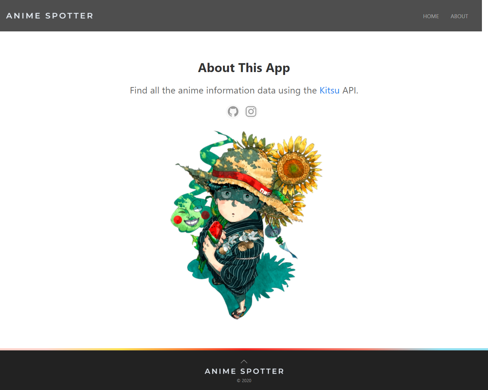

# [Anime Spotter][homepageURL]
[![NPM][homepageBadge]][homepageURL] ![NPM][npmBadge] <br/>
By [Hamza Es-saady][linkedinURL]

<!-- Logo -->
<div align="center">

</div> <br/>

<!-- Description -->
[Anime Spotter][homepageURL] is a **WEB application** to help you search for any Anime data. You'll like Anime Spotter because it is lightweight and uses a friendly and minimalist UI. Anime Spotter is not better than other existing solutions, but it can help you make a quick search of Animes with the very basic information you will need. It's a best starting point for beginners who start learning **React**.

You are free to reuse, copy, modify, and distribute, but you have to give attribution.

## Technologies & Tools
[Anime Spotter][homepageURL] is created with:
* [React][reactURL] (using Context API & Hooks) : Frontend framework
* [Node.js][nodeURL] : Runtime environment
* [UiKit][uikitURL] : Layout and styles
* [Kitsu API][kitsuURL] : Layout and styles

## Installation and configuration
First make sure that [Node][nodeURL] and [NPM][npmURL] are installed in your system.

### Clone the repo
```shell
git clone https://github.com/Kuohamkun/anime-spotter.git
cd anime-spotter
```
### Install npm packages
Install the `npm` packages described in the `package.json`:

```shell
npm install
```

### Run
In the project directory, you can run:
```shell
npm start
```
It will run the app in the development mode.<br />
Open [http://localhost:3000](http://localhost:3000) to view it in the browser.

The page will reload if you make edits.<br />
You will also see any lint errors in the console.

### Build
In the project directory, you can run:
```shell
npm run build
```
Builds the app for production to the `build` folder.<br />
It correctly bundles React in production mode and optimizes the build for the best performance.

The build is minified and the filenames include the hashes.<br />
Your app is ready to be deployed!

See the section about [deployment](https://facebook.github.io/create-react-app/docs/deployment) for more information.

## Preview

### :arrow_forward: [**Click here**][homepageURL] to visit the live version of Anime Spotter.

### Home page :  
<div align="center">

</div>
<br/>

### Search results :
<div align="center">

</div>
<br/>

### Anime Info :
<div align="center">

</div> <br/>

### About page :
<div align="center">

</div> <br/>

## Learn More
This project was bootstrapped with [Create React App](https://github.com/facebook/create-react-app). <br/>
You can learn more in the [Create React App documentation](https://facebook.github.io/create-react-app/docs/getting-started).<br/>
To learn React, check out the [React documentation](https://reactjs.org/).

## :sparkling_heart: Support me

I just start to open-source almost everything I can, and I try to reply to everyone needing help using these projects.
However, If you are using this project and happy with it and just want to **encourage** me to continue creating stuff, there are few ways you can do it :

- **Giving proper credit when you use it, linking back to it :D**
- **Starring and sharing the project :rocket:**

Thanks! :heart:

---

Contributions are welcome! <3

Made with :heart: and Passion.


<!-- IDENTIFIERS ------------------------------------------------------------->
[homepageURL]: https://anime-spotter.netlify.app
[linkedinURL]: https://www.linkedin.com/in/essaadyhamza/
[reactURL]: https://reactjs.org/ 
[nodeURL]: https://nodejs.org
[uikitURL]: https://getuikit.com/
[npmURL]: https://www.npmjs.com/
[kitsuURL]: https://kitsu.docs.apiary.io/
[homepageBadge]: https://img.shields.io/badge/VISIT_HOME_PAGE-1e87f0?style=flat-square
[npmBadge]: https://img.shields.io/npm/v/npm?color=CB3837&logo=NPM&style=flat-square
